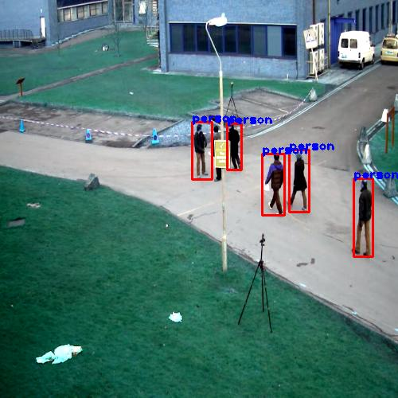
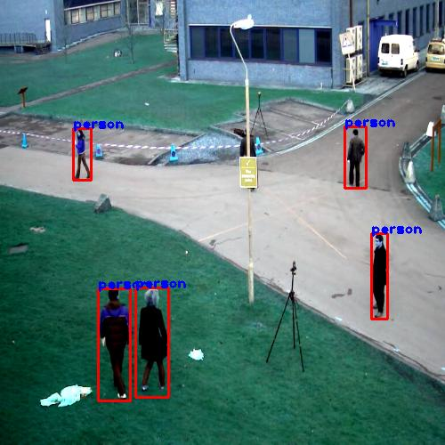

# YOLOv3-Object-Detection
YOLOv3 Object Detection Using Open CV and DNN

With yolo we can detect objects at a relatively high speed. With a GPU we would be able to process over 45 frames/second while with a CPU around a frame per second.

## To run the algorithm we need three files:

  **Weight file**: it’s the trained model, the core of the algorithm to detect the objects.[https://pjreddie.com/media/files/yolov3.weights]

  **Cfg file**: it’s the configuration file, where there are all the settings of the algorithm.

  **Name files**: contains the name of the objects that the algorithm can detect.
### Object Detected Frames:

 ***Here I have enabled object detection only for "presons".*** 

 

